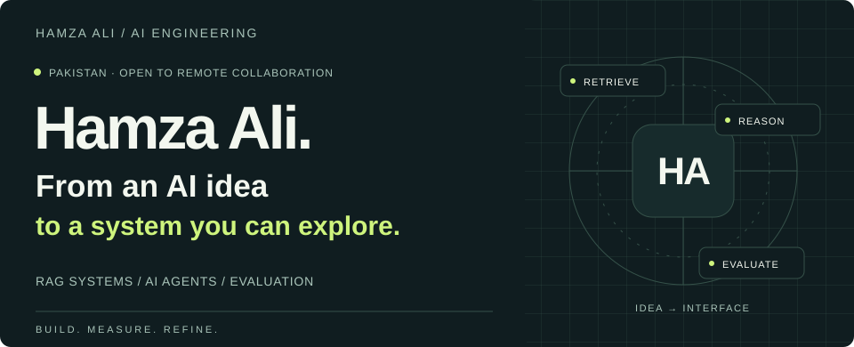
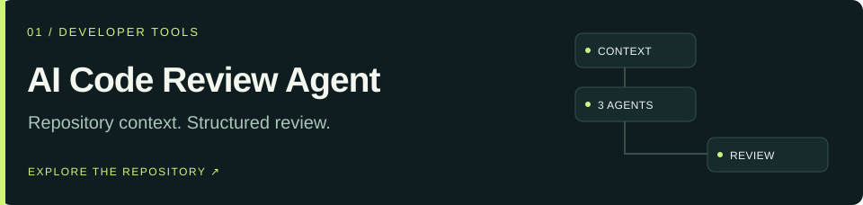
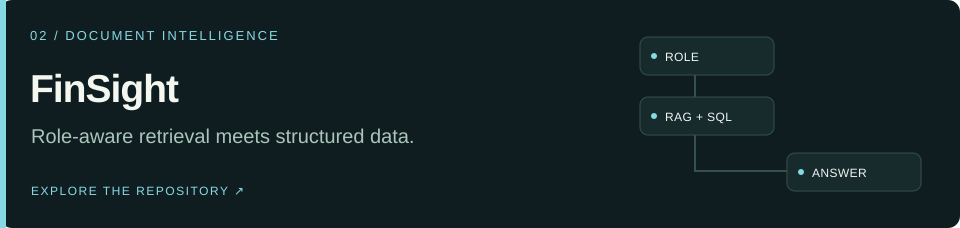
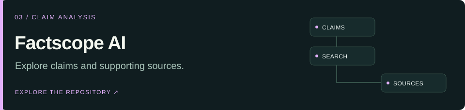

  <a href="https://personalportfolio-theta-gules-56.vercel.app/">
    <picture>
      <source media="(prefers-color-scheme: light)" srcset="assets/hero-light.svg">
      
    </picture>
  </a>

  
  
  

  <a href="#choose-your-route">Start here</a> · <a href="#selected-work">Selected work</a> · <a href="#the-lab">The lab</a> · <a href="#toolkit">Toolkit</a> · <a href="#lets-build">Contact</a>

### AI / GenAI engineer building useful, inspectable applications.

I connect language models to **documents, tools, data, and interfaces**. My projects explore the engineering around the model: retrieval, access boundaries, agent workflows, evaluation, and how people actually use the result.

Based in **Pakistan** · Open to **AI/ML & GenAI roles**, remote collaboration, and scoped client projects.

## Choose your route

<b>01 · I’m hiring — show me the strongest engineering work</b>

Start with **[AI Code Review Agent](#ai-code-review-agent)** for agent orchestration and backend design, then **[FinSight](#finsight)** for retrieval, data access, and security boundaries.

**Look for:** architecture decisions, tests, evaluation reports, and documented limitations. [Watch project walkthroughs](https://personalportfolio-theta-gules-56.vercel.app/#work) or [read my CV](https://personalportfolio-theta-gules-56.vercel.app/assets/Hamza_Ali_Resume_GenAI_Engineer.pdf).

<b>02 · I have a project — show me what we could build</b>

I can help scope a **document assistant**, an **AI workflow**, or an **evaluation and reliability review**. FinSight demonstrates document and SQL workflows; Factscope demonstrates a complete interface around claim analysis; the Brand Manager explores coordinated agent workflows.

Tell me your users, data sources, constraints, and desired outcome. [Start a project conversation](mailto:hamza1713@gmail.com?subject=AI%20project%20inquiry).

<b>03 · I’m reviewing the technology — take me to the evidence</b>

| Explore | Inspect |
| :--- | :--- |
| Agent design | [Architecture and structure](https://github.com/hamza1713/AI-Code-Review-Agent/blob/main/docs/ARCHITECTURE_AND_STRUCTURE.md) |
| Evaluation | [Code review benchmark report](https://github.com/hamza1713/AI-Code-Review-Agent/blob/main/BENCHMARK_REPORT.md) |
| Access boundaries | [FinSight security regression tests](https://github.com/hamza1713/Enterprise-RAG-Chatbot-with-Role-Base-Access-Control-/blob/main/verification/test_security.py) |
| Deployment readiness | [FinSight readiness report](https://github.com/hamza1713/Enterprise-RAG-Chatbot-with-Role-Base-Access-Control-/blob/main/PRODUCTION_READINESS_REPORT.md) |
| Full-stack delivery | [Portfolio source and CI](https://github.com/hamza1713/Portfolio/actions) |

## Selected work

Three projects that show how I approach AI application engineering. **Select a card to explore its repository; expand the notes to go deeper.**

**Make code changes easier to investigate.** Combines static analysis, repository context, governance rules, and three CrewAI review roles. Includes a React dashboard, durable webhook queue, SARIF export, and MCP tools.

`Python` `FastAPI` `CrewAI` `React` `SQLite`

**[Source](https://github.com/hamza1713/AI-Code-Review-Agent) · [Architecture](https://github.com/hamza1713/AI-Code-Review-Agent/blob/main/docs/ARCHITECTURE_AND_STRUCTURE.md) · [Tests](https://github.com/hamza1713/AI-Code-Review-Agent/tree/main/tests)**

<b>Inside the build → workflow, evaluation, and tradeoffs</b>

**Workflow:** gather code context → combine analysis and agent reviews → apply governance → present findings for human review.

**Engineering focus:** durable webhook processing, structured results, context retrieval, and multiple ways to inspect or export findings.

**Evidence:** the checked-in [benchmark report](https://github.com/hamza1713/AI-Code-Review-Agent/blob/main/BENCHMARK_REPORT.md) records **84.2% finding-level F1** and **100% verdict accuracy across 14 curated cases**. These are distinct metrics on a small benchmark; they do not establish general accuracy. Generated tests and execution support depend on the configured review path and tools.

 

**Ask questions across documents and structured data.** A RAG + SQL workspace with department-scoped retrieval, six roles, and restricted SQL execution.

`Python` `FastAPI` `LangChain` `ChromaDB` `DuckDB` `React`

**[Source](https://github.com/hamza1713/Enterprise-RAG-Chatbot-with-Role-Base-Access-Control-) · [Security tests](https://github.com/hamza1713/Enterprise-RAG-Chatbot-with-Role-Base-Access-Control-/blob/main/verification/test_security.py) · [Readiness](https://github.com/hamza1713/Enterprise-RAG-Chatbot-with-Role-Base-Access-Control-/blob/main/PRODUCTION_READINESS_REPORT.md)**

<b>Inside the build → retrieval, access controls, and readiness</b>

**Workflow:** identify role → route the question → retrieve scoped documents or query structured data → stream the response.

**Engineering focus:** authorization boundaries, retrieval filters, SQL restrictions, response streaming, and regression checks.

**Current scope:** documented as a **staging candidate**, with remaining deployment and evaluation gates. The readiness report and security tests are the useful starting points for assessing suitability for a real environment.

 

**Turn news content into claims people can examine.** Extracts claims and requests search-grounded assessments with citations, delivered through web and Electron desktop interfaces.

`TypeScript` `React` `Express` `Gemini` `Electron`

**[Source](https://github.com/hamza1713/Factscope-AI) · [Analysis endpoint](https://github.com/hamza1713/Factscope-AI/blob/main/api/analyze.ts) · [Watch walkthroughs](https://personalportfolio-theta-gules-56.vercel.app/#work)**

<b>Inside the build → grounding, caching, and provider fallbacks</b>

**Workflow:** extract claims → request analysis and supporting sources → return structured assessments for review.

**Engineering focus:** a shared analysis flow, desktop packaging, caching, and fallback paths when provider quotas are reached.

**Tradeoff:** the final fallback runs without search grounding. Citation availability and human review matter; a generated assessment is not a guarantee that a claim is true or false.

## The lab

More ways I explore agents, multimodal AI, machine learning, and product delivery.

| Project | What to explore |
| :--- | :--- |
| **[Social Media Brand Manager ↗](https://github.com/hamza1713/Autonomous-Social-Media-Brand-Manager)** | Five CrewAI agents for strategy, content, brand review, engagement drafts, and analytics. Final year project with simulated social APIs and sample metrics. |
| **[Deep-Fake Detection ↗](https://github.com/hamza1713/Deep-Fake-Detection)** | Multimodal analysis with a React interface. Experimental media assessment; confidence scores are not calibrated forensic accuracy. [Open demo](https://deep-fake-detection-pi.vercel.app). |
| **[Airline Customer Satisfaction ↗](https://github.com/hamza1713/DS-ML-PROJECTS)** | Data preparation, XGBoost tuning with cross-validation, held-out metrics, and feature importance. Includes the notebook and dataset. |
| **[Interactive Portfolio ↗](https://github.com/hamza1713/Portfolio)** | React/TypeScript application with project videos, an AI assistant, and an inquiry flow. [Explore the website](https://personalportfolio-theta-gules-56.vercel.app/). |

## Toolkit

**Click any badge to see where I use it.** Expand a category to explore the stack behind my projects.

<b>Languages</b>

The languages behind my APIs, interfaces, and data workflows.

  
  
  
  
  
  

<b>AI & agent engineering</b>

Agent orchestration, retrieval workflows, and model integration.

  
  
  
  

<b>Frontend & application frameworks</b>

Interfaces for exploring AI results on the web and desktop.

  
  
  
  
  
  
  

<b>Databases & retrieval</b>

Structured storage, analytical queries, and vector search.

  
  
  

<b>Data science & machine learning</b>

Data preparation, model tuning, and evaluation in my airline satisfaction project.

  
  
  
  
  

<b>Developer tools, testing & delivery</b>

Version control, automated checks, packaging, and deployment.

  
  
  
  
  

<b>Learning and foundations</b>

My learning includes the Machine Learning Specialization (Stanford Online / DeepLearning.AI), Deep Learning Specialization (DeepLearning.AI), multi-agent systems with CrewAI, and retrieval-augmented generation coursework.

My [GitHub Copilot agent mode exercise](https://github.com/hamza1713/skills-build-applications-w-copilot-agent-mode) contains course material and setup instructions.

## Let’s build

**Have a role, a useful problem, or an idea worth testing?** I’d like to hear about it.

[Email me](mailto:hamza1713@gmail.com) · [Connect on LinkedIn](https://www.linkedin.com/in/hamza-ali-b9b8b22a6) · [Explore the interactive portfolio](https://personalportfolio-theta-gules-56.vercel.app/)

Project descriptions reviewed against public source in September 2026. Linked repositories, tests, and reports provide current implementation context.

[Back to top ↑](#top)
